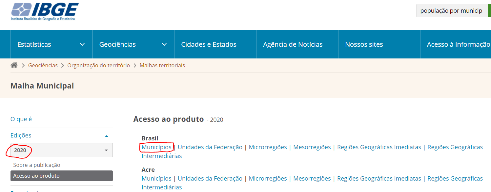
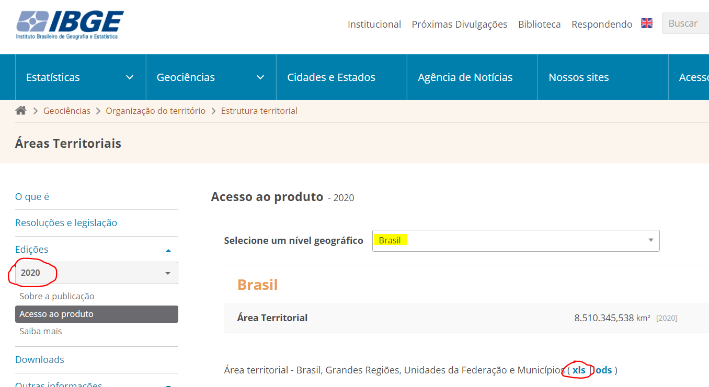

# Where does this come from?
The data used in this analysis is coming from [IBGE](https://www.ibge.gov.br/pt/inicio.html), the IBGE is the public institute in charge of provide geographic and statistics information for Brazil.

# What exactly is the data used in where can I find it?
## BR_Municipios_2020.shp
- **This is a shapefile with municipalities polygons from Brazil**
- **Fields**:
    - **CD_MUN**   -> *Municipality Code*
    - **NM_MUN**   -> *Municipality Name*
    - **SIGLA_UF** -> *State code where the municipality belongs to*
    - **AREA_KM2** -> *square kilometers of the municipalities*
- **Official location**: it's possible to download the data directly from IBGE portal, here it was decided to consider Brazil level but, it is possible to get it specific by states as well
    - [Brazil Municipalities SHAPEFILE link](https://www.ibge.gov.br/geociencias/organizacao-do-territorio/malhas-territoriais/15774-malhas.html?=&t=acesso-ao-produto)
    - 

## AR_BR_RG_UF_RGINT_RGIM_MES_MIC_MUN_2019.xls
- **This is a xls file with tabular information from Brazil**
- **Fields**:
    - **NM_UF**       -> *State code where the minicipality belongs to*
    - **CD_GCMUN**    -> *Municipality Code*
    - **NM_MUN_2020** -> *Municipality Name*
    - **AR_MUN_2020**    -> *square kilometers of the municipalities*
- **Official location**: It's also possible to download the data direclty from IBGE portal, here it was decided to consider Brazil level but, it is possible to get it specific by state as well
    - [Brazil Municipalities XLSX link](https://www.ibge.gov.br/geociencias/organizacao-do-territorio/estrutura-territorial/15761-areas-dos-municipios.html?t=acesso-ao-produto&c=1)
    - 
    
# Remarks:
- This repository is using Git LFS to handle with large files, if you're facing any issue, please refer to the official documentation